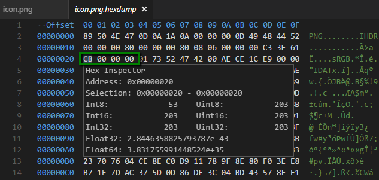

# vscode-hexdump

hexdump for Visual Studio Code

## Description

Display a specified file in hexadecimal

## Main Features

Right-click on a file in the explorer to see *Show hexdump for file*  

Hover in the data section to see numerical values  

Right-click in the hexdump to see more options  

## Commands

* `hexdumpFile` (`ctrl+shift+alt+h`, `cmd+shift+alt+h`) Show hexdump for file
* `editValue` (`shift+enter`) Edit the value under the cursor
* `gotoAddress` (`ctrl+g`) Go to a specific address
* `exportToFile` (`ctrl+s`, `cmd+s`) Export to a binary file

## Configuration

* `hexdump.littleEndian` Set default endianness (true for little endian, false for big endian)
* `hexdump.nibbles` How many nibbles per group (2, 4)
* `hexdump.uppercase` Display hex digits in uppercase
* `hexdump.width` Number of bytes per line (8, 16, 32)
* `hexdump.showOffset` Show offset on first line
* `hexdump.showAddress` Show address on each line
* `hexdump.showAscii` Show ascii section

## Installation

1. Install *Visual Studio Code* (1.6.0 or higher)
2. Launch *Code*
3. From the command palette `Ctrl-Shift-P` (Windows, Linux) or `Cmd-Shift-P` (OSX)
4. Select `Install Extension`
5. Choose the extension `hexdump for VSCode`
6. Reload *Visual Studio Code*

## Contributing

1. Fork it!
2. Create your feature branch: `git checkout -b my-new-feature`
3. Commit your changes: `git commit -am 'Add some feature'`
4. Push to the branch: `git push origin my-new-feature`
5. Submit a pull request :D

## Requirements

Visual Studio Code v1.6.0

## Credits

* [Visual Studio Code](https://code.visualstudio.com/)
* [vscode-docs on GitHub](https://github.com/Microsoft/vscode-docs)
* [hexdump-nodejs on GitHub](https://github.com/bma73/hexdump-nodejs)
* [hexy.js on GitHub](https://github.com/a2800276/hexy.js)

## License

[MIT](LICENSE.md)

---

## Changelog

### [1.1.1] 2016-10-25

* Add color to the Hex Inspector
* Improve support for large files

### [1.0.1] 2016-10-18

* Fix an issue with syntax colorization

### [1.0.0] 2016-10-10

* Update if file changes (#2, #3, thanks @camwar11)
* Switch to [hexy.js](https://www.npmjs.com/package/hexy) (#4, thanks @boguscoder)
* Highlight selection in both hex and ascii sections (#6)
* More display options (see Configuration) (#5, #7)

### [0.1.1] 2016-08-17

* Add screenshots to README.md

### [0.1.0] 2016-08-17

* Hover to display data values
* Command to toggle between little and big endianness
* Status bar to indicate current endianness

### [0.0.2] 2016-07-12

* Edit value under cursor
* Syntax colorization
* Commands in context menus
* Go to address
* Export to file

### [0.0.1] 2016-06-01

* Display a specified file in hexadecimal

[1.1.1]: https://github.com/stef-levesque/vscode-hexdump/compare/802b67edbe33af050315bb953fc1ce2c69b6ffc7...ff198785736dc683be10ceca85ed1b114b151e11
[1.0.1]: https://github.com/stef-levesque/vscode-hexdump/compare/0fba91206d32dcc01d31a6fd2a544fc6b5e0c26f...fd688a793d63e2cf76b3c169510c4d598cf180dc
[1.0.0]: https://github.com/stef-levesque/vscode-hexdump/compare/dcb67df9426583a9968888bbe7ce83a823e2e592...52e55624cb105501c5aee169a9cfd6d4c769949b
[0.1.1]: https://github.com/stef-levesque/vscode-hexdump/compare/82d035ae76ca09293f13a60df6bc6da8adf4302a...ff9e1658aa4205d49520d4a0bd5043c027ed98a4
[0.1.0]: https://github.com/stef-levesque/vscode-hexdump/compare/47ae52ae080a531910c1fb9da736f1194d9af5ac...75b1bb35a09a0f87de464a74a51e96099ff90225
[0.0.2]: https://github.com/stef-levesque/vscode-hexdump/compare/ba05da59122e25f39fbcaa39b82e98b7f1f3022e...8cfee8b0398313ca58120ec9d19c38c384042536
[0.0.1]: https://github.com/stef-levesque/vscode-hexdump/commit/ba05da59122e25f39fbcaa39b82e98b7f1f3022e
